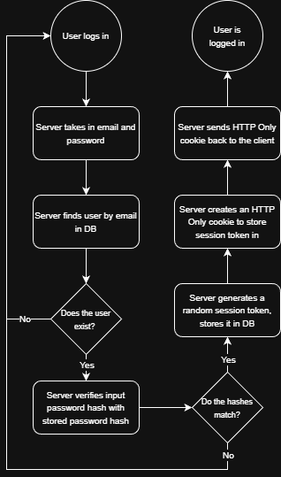

I miss QuizUp so I made my own : )

## Server

To run the server, do `cd server` (assuming you're in the root directory) then `npm run dev`. This runs the TypeScript code directly from `src/index.ts` with auto-reload enabled

Everytime you make changes to the schema in `prisma/schema.prisma`, you need to run `npx prisma migrate dev` to make those changes in the database. If you want to add a name for your migration for documentation purposes, you can add `--name <value>`. The full command would then be `npx prisma migrate dev --name <value>`. Then, you do `npx prisma generate` to generate the new models inside your `generated/prisma/` directory.

## Authentication

### Session-based authentication

One form of authentication that was implemented in this project is **session-based authentication**. This is for when the user signs up or logs in with an email and password.



In the diagram above, it shows how the server handles a user login. After the user is logged in, all subsequent requests to the server that need to be authorized has the HTTP-only cookie attached to the request headers. This happens because I set up middleware that runs on each request before the actual logic runs:

```
// this function is in server/src/routes/auth/auth.middleware.ts
export const authorizeRequest = async (
  req: Request,
  res: Response,
  next: NextFunction
) => {
  const sessionToken = req.cookies.session;

  if (!sessionToken) {
    return res.status(401).json({ error: 'Unauthorized: No session token' });
  }

  try {
    const { session, user } = await validateSession(sessionToken);

    if (!session || !user) {
      return res.status(401).json({ error: 'Unauthorized: Invalid session' });
    }

    req.user = user;
    next();
  } catch (error) {
    console.error('Session validation error:', error);
    return res.status(500).json({ error: 'Internal server error' });
  }
};
```

We need to actually register this middleware somewhere, though. We do that by adding it to the router associated with the group of endpoints you want to attach it to:

```
// this code is in server/src/routes/quizzes/quizzes.controller.ts
const router = Router();
router.use('/quizzes', authorizeRequest); // run authorizeRequest middleware on any /quizzes endpoint
```

If we wanted to protect an endpoint so that only the owner of the resource can edit or access it, then we can use this function:

```
// this function is in server/src/routes/auth/auth.middleware.ts
export const authorizeProtectedEndpoint = async (
  req: Request,
  res: Response,
  next: NextFunction
) => {
  const { user } = req;
  const { userId } = req.params; // the user id to be viewed or edited

  // if the user who requested does not match the id of the user resource, they can't edit
  if (user.id != userId) {
    return res
      .status(401)
      .json({ error: 'Unauthorized: You do not own this resource' });
  }

  next();
};
```

Of course, don't forget to register it to the endpoint:

```
// this function is in server/src/routes/users/users.controller.ts
router.patch(
  '/users/:userId',
  authorizeProtectedEndpoint,
  async (req: Request, res: Response) => { ... }
```

To test if this actually works, you can use a tool like Postman to send a request to `/api/auth/login` which stores a cookie in the application, and then send a request to another endpoint like `/api/quizzes/1`. It should let you access a quiz. If you clear cookies in Postman and try the `/api/quizzes/1` endpoint again, you would see in the response body that you're not authorized to view the resource.

### OAuth 2.0

...

<br>

Article I read for implementing email/password session-based authentication: https://www.robinwieruch.de/how-to-roll-your-own-auth/

Video I watched for implementing OAuth 2.0 authorization: https://www.youtube.com/watch?v=lOSs7jHO7QU

<br>

## Websockets
